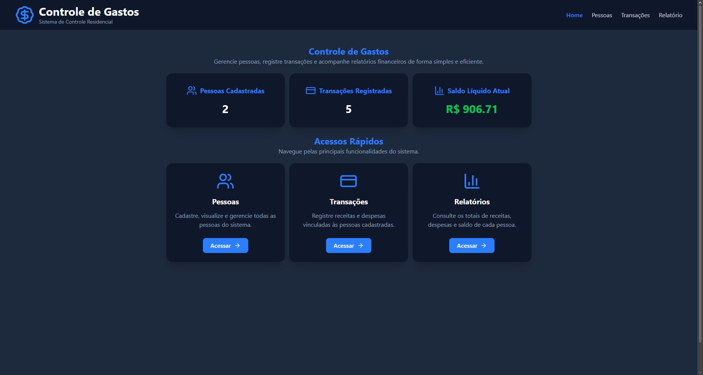
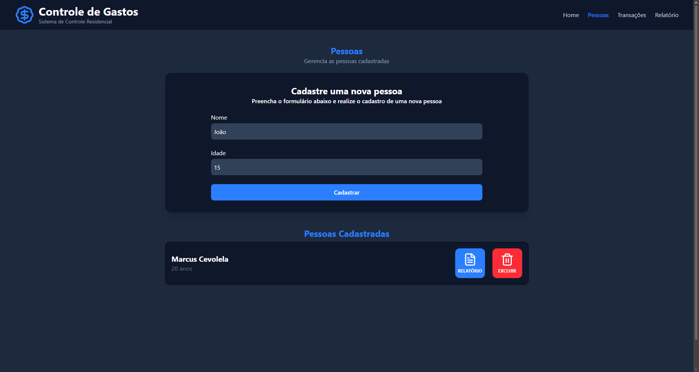
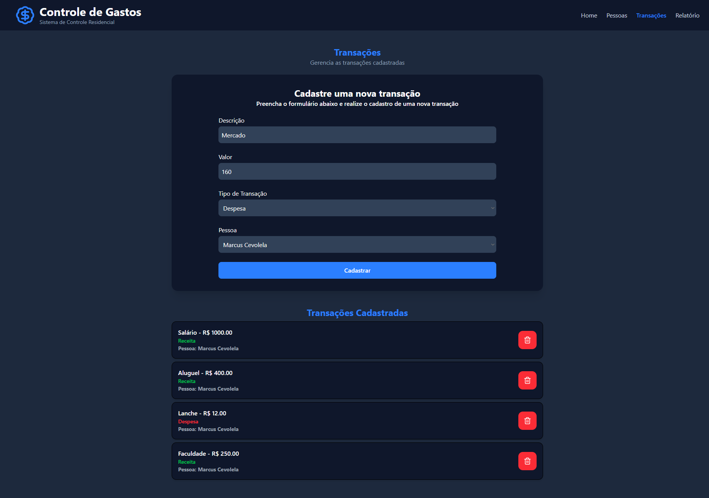
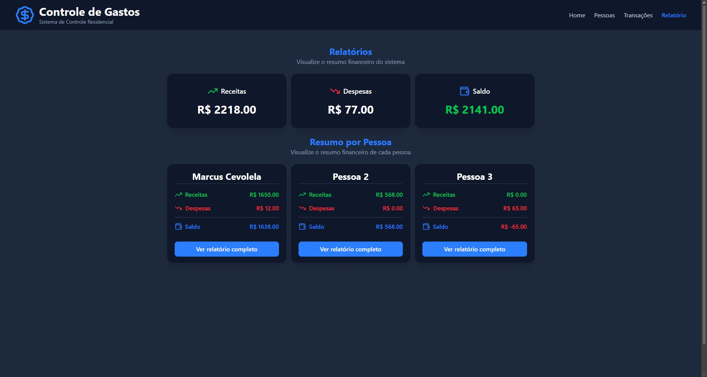
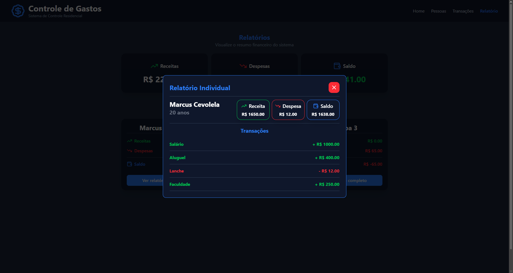

# 💰 Controle de Gastos

Sistema desenvolvido como parte de um teste técnico, com o objetivo de gerenciar pessoas, transações financeiras e relatórios de gastos residenciais.

A aplicação permite gerenciar pessoas e transações financeiras, gerando relatórios individuais e gerais de receitas, despesas e saldo, seguindo todas as regras de negócio propostas no desafio.

---

## 🚀 Tecnologias Utilizadas

### Backend
- ASP.NET Core
- C#
- Entity Framework Core
- SQLite (persistência de dados)

### Frontend
- React
- TypeScript
- Vite
- Tailwind CSS
- React Router DOM
- Lucide React

---

## 📋 Funcionalidades

### Pessoas
- Cadastro de pessoas
- Listagem de pessoas
- Exclusão de pessoas
- Exclusão automática das transações relacionadas

### Transações
- Cadastro de receitas e despesas
- Listagem de transações
- Validação para menores de idade (apenas despesas)

### Relatórios
- Relatório financeiro geral
- Relatório financeiro individual
- Total de receitas
- Total de despesas
- Saldo por pessoa
- Saldo geral

### Interface
- Layout responsivo
- Menu mobile
- Modal reutilizável
- Validações no frontend

---

## 📁 Estrutura do Projeto

```
CONTROLE-GASTOS
│
├── backend
│   ├── Controllers
│   ├── Data
│   ├── DTOs
│   ├── Enums
│   ├── Models
│   ├── Services
│   └── ...
│
├── frontend
│   ├── src
│   │   ├── components
│   │   ├── pages
│   │   ├── services
│   │   ├── interfaces
│   │   ├── router
│   │   └── ...
│   └── ...
│
└── ControleGastos.sln
```

---

## 🏗️ Arquitetura

O projeto foi desenvolvido utilizando arquitetura em camadas.

### Backend

- Controllers → recebem as requisições HTTP.
- Services → concentram a lógica de negócio.
- DTOs → realizam a comunicação entre API e cliente.
- Models → representam as entidades do sistema.
- Data → configuração do Entity Framework e banco de dados.

### Frontend

- Pages → telas da aplicação.
- Components → componentes reutilizáveis.
- Services → comunicação com a API.
- Interfaces → tipagem dos dados.
- Router → gerenciamento das rotas.

---

## ▶️ Como Executar

### 1. Clonar o repositório

```bash
git clone https://github.com/marcus-cevolela/controle-gastos.git
```

Acesse a pasta do projeto:

```bash
cd controle-gastos
```

---

### 2. Executar o Backend

Abra um terminal e navegue até a pasta da API:

```bash
cd backend/ControleGastos.Api
```

Restaure as dependências do projeto:

```bash
dotnet restore
```

Execute a aplicação:

```bash
dotnet run
```

Após a inicialização, a API estará disponível e a documentação Swagger poderá ser acessada em:

```
http://localhost:5052/swagger
```

---

### 3. Executar o Frontend

Abra um novo terminal e navegue até a pasta do frontend:

```bash
cd frontend
```

Instale as dependências:

```bash
npm install
```

Inicie a aplicação:

```bash
npm run dev
```

Após a inicialização, o Vite exibirá o endereço da aplicação, normalmente:

```
http://localhost:5173
```

> **Observação:** mantenha o backend em execução para que o frontend consiga se comunicar com a API.

---

## 📌 Regras de Negócio Implementadas

- Pessoas possuem identificador gerado automaticamente.
- Transações só podem ser cadastradas para pessoas existentes.
- Pessoas menores de 18 anos podem cadastrar apenas despesas.
- Ao excluir uma pessoa, todas as suas transações também são removidas.
- Os relatórios apresentam receitas, despesas e saldo individual e geral.

---

## 💡 Decisões de Implementação

Durante o desenvolvimento, optei por:

- Organizar o backend em camadas (Controllers, Services e DTOs).
- Separar a lógica de negócio da camada de apresentação.
- Utilizar componentes reutilizáveis no frontend.
- Documentar o código com comentários para facilitar a leitura.
- Desenvolver uma interface responsiva para desktop e dispositivos móveis.

---

## 📸 Demonstração

### Home



### Cadastro e Listagem de Pessoas



### Cadastro e Listagem de Transações



### Relatório Geral e Individual



### Relatório Individual Detalhado




---

## ✔️ Considerações

Este projeto foi desenvolvido seguindo os requisitos do teste técnico, priorizando organização do código, separação de responsabilidades, reutilização de componentes, responsividade e documentação para facilitar a manutenção e compreensão da aplicação.

---

## 👨‍💻 Autor

Marcus Vinícius Cevolela

- GitHub: <https://github.com/marcus-cevolela>
- LinkedIn: <https://www.linkedin.com/in/marcus-cevolela/>